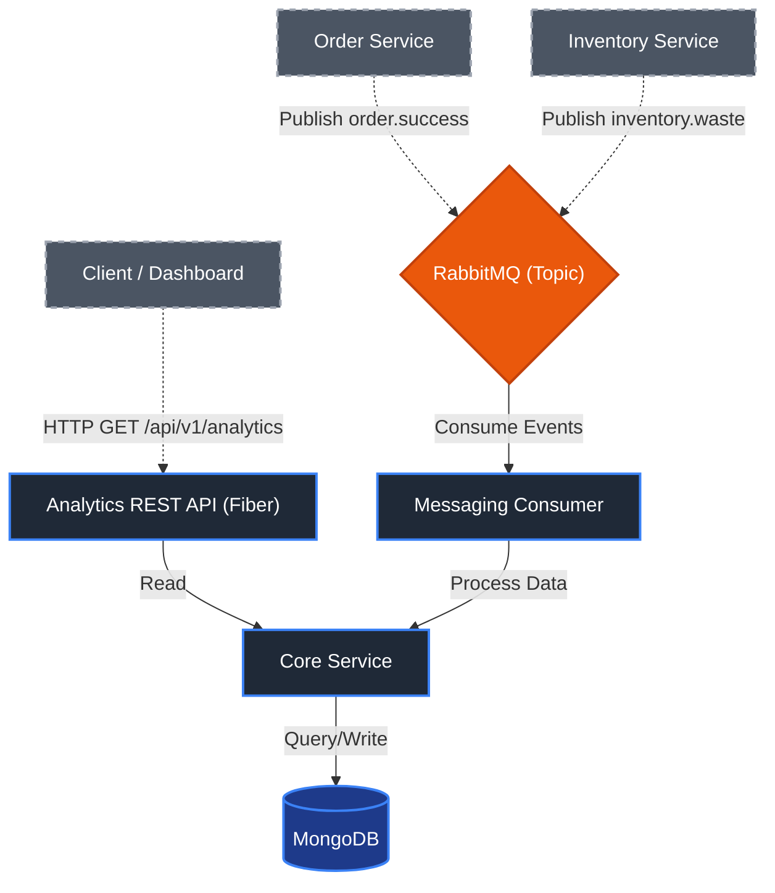

# Analytics Service

The Analytics Service is a robust, event-driven microservice responsible for aggregating, processing, and serving real-time analytics data for the Gelato Management Platform. It asynchronously consumes operational events (like order successes and inventory waste) from RabbitMQ, stores processed metrics in MongoDB, and exposes them via a fast REST API for dashboards.

---

## 🗺️ Component & Directory Mapping

Explain the directory organization and the responsibilities of each component:

### 1. Application Entrypoint
* **Directory:** `cmd/api`
* **Purpose:** The main executable package that initializes configuration, connections (DB & Message Broker), and starts the server.
* **Key Files:**
  - `main.go`: Bootstraps the application, wires dependencies, and starts the Fiber HTTP server and RabbitMQ consumer.

### 2. Configuration
* **Directory:** `config`
* **Purpose:** Handles environment variables and application configurations.
* **Key Files:**
  - `config.go`: Loads and parses `.env` variables for Mongo URI, RabbitMQ URL, and server ports.

### 3. API Handlers
* **Directory:** `internal/handler/v1`
* **Purpose:** Controller layer containing HTTP handlers to process incoming web requests.
* **Key Files:**
  - `analytics.go`: Defines the `GetAnalytics` handler for retrieving statistical data based on time periods.

### 4. Messaging (Event Consumer)
* **Directory:** `internal/messaging`
* **Purpose:** Interfaces with RabbitMQ to consume asynchronous domain events from other microservices.
* **Key Files:**
  - `consumer.go`: Subscribes to AMQP topic exchanges, enforces fair QoS dispatching, and routes events to the service layer.

### 5. Domain Models
* **Directory:** `internal/models`
* **Purpose:** Defines the data structures, database schemas, and event message schemas.
* **Key Files:**
  - `analytics.go`: Contains BSON structures for MongoDB and JSON schemas for incoming RabbitMQ messages.

### 6. Data Access Layer
* **Directory:** `internal/repository`
* **Purpose:** Abstracts interactions with the MongoDB database. Note: Shadow tables of other services are strictly prohibited; Analytics does not maintain an `orders` collection.
* **Key Files:**
  - `analytics_repo.go`: Implements operations to query and update daily analytics records.
  - `event_repo.go`: Implements `ProcessedEventRepository` for idempotency and event deduplication by CloudEvents `event.id`.

### 7. External Service Clients (gRPC)
* **Directory:** `internal/client`
* **Purpose:** Interfaces with internal backend services via synchronous gRPC.
* **Key Files:**
  - `order_client.go`: Connects to `Order Service`, implementing `StreamOrderItems` (client-streaming RPC) and `GetOrderDetails` (unary RPC).

### 8. Core Service Logic
* **Directory:** `internal/service`
* **Purpose:** Houses the core business logic, aggregating data and applying domain rules.
* **Key Files:**
  - `analytics_service.go`: Processes raw events from the messaging layer and prepares analytical data for the handler, querying `Order Service` via gRPC when order details are needed.

### 9. Router Setup
* **Directory:** `internal/router`
* **Purpose:** Configures all HTTP API routes.
* **Key Files:**
  - `router.go`: Registers Fiber routes and mounts handlers to specific endpoints.

---

## 🏗️ System Architecture

A visual flow of how different components and services interact in this project:



---

## 📡 Standard API Spec

### `GET /api/v1/analytics/summary`
Retrieves aggregated analytics data for the business (matching `docs/API_SPEC.md`).

**Access**: Protected (MANAGER role)

**Query Parameters:**
- `period` (string, default `1w`): The time window for the analytics (valid values: `1d`, `1w`, `1m`, `6m`).

**Response (200 OK):**
```json
{
  "totalRevenue": 15000,
  "totalOrders": 150,
  "totalScoops": 450,
  "totalWaste": 80,
  "salesByFlavor": [
    {
      "flavorId": "flv_vanilla",
      "flavorName": "Vanilla",
      "portions": 200,
      "revenue": 10000
    }
  ],
  "wasteByFlavor": [
    {
      "flavorId": "flv_vanilla",
      "flavorName": "Vanilla",
      "portions": 50
    }
  ],
  "salesTrend": [
    {
      "date": "2026-09-01",
      "label": "Sep 1",
      "revenue": 5000,
      "orders": 50,
      "scoops": 150
    }
  ]
}
```

**Error Responses (conforming to `docs/API_SPEC.md` Section 8):**
All errors follow a uniform JSON structure:
```json
{
  "message": "User-friendly error message",
  "code": "ERROR_CODE"
}
```
Common codes returned:
- `400 Bad Request` (`HTTP_400`) - Invalid query parameter (e.g., unsupported period)
- `404 Not Found` (`HTTP_404`) - Unmatched endpoint path
- `500 Internal Server Error` (`UNKNOWN_ERROR`) - Unexpected internal error

---

## 📨 Consumable Message Schemas (RabbitMQ)

The service acts as an event subscriber and listens on topic exchanges for:

### 1. `order.placed` / `OrderPlaced` (Exchange: `order`)
Triggered when an order is completed. Supports CloudEvents 1.0 schema with `snake_case` or `camelCase` payload.

### 2. `order.cancelled` / `OrderCancelled` (Exchange: `order`)
Triggered when an order is cancelled, rolling back analytics records for that order date.

### 3. `inventory.waste` / `WasteRecorded` (Exchange: `inventory`)
Triggered when inventory is recorded as waste (expired, damaged, quality).

---

## 🚀 Getting Started & Installation

Follow these steps to set up and run this project locally.

### Prerequisites
- Go >= 1.20
- Docker & Docker Compose (for RabbitMQ and MongoDB)

### Installation Steps

1. **Clone the repository:**
   ```bash
   git clone <repo_url>
   cd backend-gelato-management/analytics-service
   ```

2. **Install dependencies:**
   ```bash
   go mod download
   ```

3. **Configure Environment Variables:**
   Create a `.env` file in the root of the `analytics-service` directory by copying the template below:
   ```bash
   cp .env.test .env
   ```
   *(Update the values to point to your local RabbitMQ and MongoDB instances).*

4. **Start the application:**
   ```bash
   go run cmd/api/main.go
   ```

---

## ⚙️ Environmental Configuration (.env)

The application requires the following environment variables. Ensure these are set in your `.env` file before booting the system.

```env
# ==========================================
# Database Configurations
# ==========================================
# [Required] Connection string for the MongoDB instance
MONGO_URI=mongodb://<username>:<password>@localhost:27017

# ==========================================
# Message Broker Configurations
# ==========================================
# [Required] Connection string for RabbitMQ server
RABBITMQ_URL=amqp://<username>:<password>@localhost:5672/

# ==========================================
# gRPC Services Configurations
# ==========================================
# [Optional] Target address for Order Service gRPC (Default: localhost:50051)
ORDER_SERVICE_GRPC_ADDR=localhost:50051

# ==========================================
# Application Configurations
# ==========================================
# [Optional] Port for the Fiber HTTP Server (Default: 3000)
PORT=3000
```

---

## 🧪 Running Tests

To run the integration tests locally, you must first prepare the development infrastructure. The tests require a real RabbitMQ and MongoDB instance running on `localhost`.

**1. Spin up the infrastructure:**
Ensure RabbitMQ and MongoDB are running and accessible on `localhost`. Use the development override from the root of the project:
```bash
docker compose --env-file .env -f docker/compose.yml -f docker/compose.dev.yml up -d rabbitmq analytics-mongodb
```
*(See the [Infrastructure README](../infra/README.md) for more details).*

**2. Run the Go test suite:**
Execute the following command inside the `analytics-service` directory to run all tests recursively (including integration tests):
```bash
go test -v -count=1 ./tests/...
```
